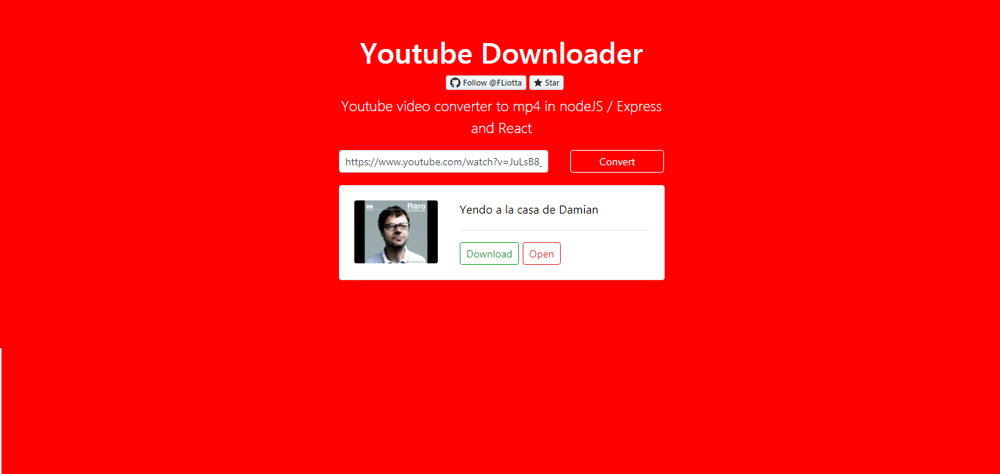

# Youtube-Downloader :musical_note:

NodeJS / Express / React website that allow you to download youtube's videos using ytdl-core.



## Install

Install all the dependencies with 

```
npm install 
npm run client-install
``` 
Run the app

```
npm run dev
```

## Demo

https://hidden-crag-23989.herokuapp.com/